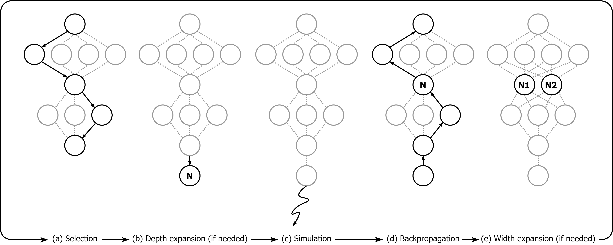

Continuous Monte Carlo Graph Search
======
Code for the *Continuous Monte Carlo Graph Search* (AAMAS 2024), [arXiV](https://arxiv.org/abs/2210.01426) 



Continuous Monte Carlo Graph Search is an extension of MCTS to online planning in environments with continuous state and action spaces. CMCGS takes advantage of the insight that, during planning, sharing the same action policy between several states can yield high performance. To implement this idea, at each time step, CMCGS clusters similar states into a limited number of stochastic action bandit nodes, which produce a layered directed graph instead of an MCTS search tree. Experimental evaluation shows that CMCGS outperforms comparable planning methods in several complex continuous DeepMind Control Suite benchmarks and a 2D navigation task with limited sample budgets. Furthermore, CMCGS can be parallelized to scale up and it can outperform the Cross-Entropy Method (CEM) in continuous control with learned dynamics models.

Environment
------------
Execute the following commands to create the environment:
```
conda create -n cmcgs python=3.9
conda activate cmcgs
pip3 install -r requirements.txt
```

Experiments
------------
For running the toy environment experiment (Section 5.1) or the PlaNet experiments (Section 5.3) with the parallel data collection, please see subdirectory `PlaNet_and_ToyEnv`.

For running the DeepMind Control Suite experiments and the 2D environment experiments (Section 5.2) without the parallelism, please see subdirectory `DMC_and_2D`.

Acknowledgments
------------
Our codebase is built on the [PyTorch implmenetation of PlaNet](https://github.com/Kaixhin/PlaNet) and [Google DeepMind Acme](https://github.com/google-deepmind/acme). We want to thank them for their work.
